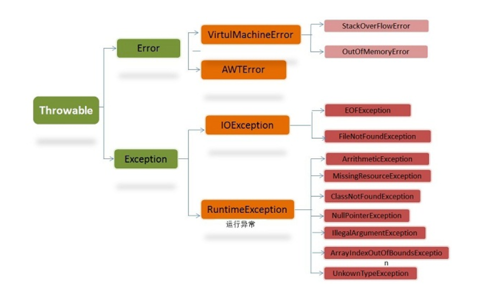

# 异常

### 1、异常类继承图

 

### 2、两大分支Error 和 Exception

#### 2.1 Error：
Error及其子类用来描述Java运行系统中的内部错误以及资源耗尽的错误，       是**程序无法处理的错误**，这类错误比较严重。这类的大多数错误与代码编写者执行的操作无关，如，运行代码时，JVM（Java虚拟机）出现的问题，例如，Java虚拟机运行错误（Virtual MachineError），当 JVM 不再有继续执行操作所需的内存资源时，将出现 OutOfMemoryError。这些异常发生时，Java虚拟机（JVM）一般会选择线程终止。 **这些错误是不可查的**，因为它们在应用程序的控制和处理能力之外，而且绝大多数是程序运行时不允许出现的状况。对于设计合理的应用程序来说，即使确实发生了错误，本质上也不应该试图去处理它所引起的异常状况。    

#### 2.2 Exception:

Exception：可以通过捕捉处理使程序继续执行，是程序自身可以处理的异常，也称为非致命性异常类。根据错误发生原因可分为RuntimeException异常和除RunTimeException之外的异常，如IOException异常。RuntimeException 类及其子类表示“JVM 常用操作”引发的错误。例如，若试图使用空值对象引用、除数为零或数组越界，则分别引发运行时异常（NullPointerException、ArithmeticException）和 ArrayIndexOutOfBoundException。

### 3、可查异常 和 不可查异常

#### 3.1 可查异常：
可查异常：编译器要求必须处理的异常，这类异常的发生在一定程度上是可以预计的，而且这类异常一旦发生，就必须采用某种方式进行处理。除了RuntimeException及其子类以外的其它异常类都属于可查异常。这种异常的特点是Java编译器会检查它，也就是说，出现这种异常，要么用try-catch语句捕捉它，要么用throws语句声明抛出它，否则编译不通过。

#### 3.2 不可查异常：
编译器不要求强制处理的异常，包括运行时异常（RuntimeException与其子类）和错误（Error） 。